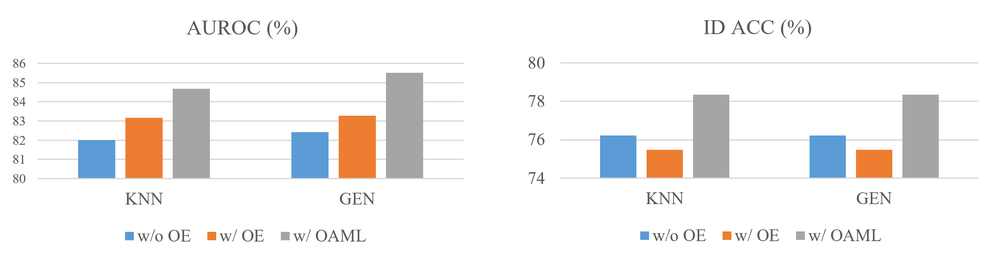
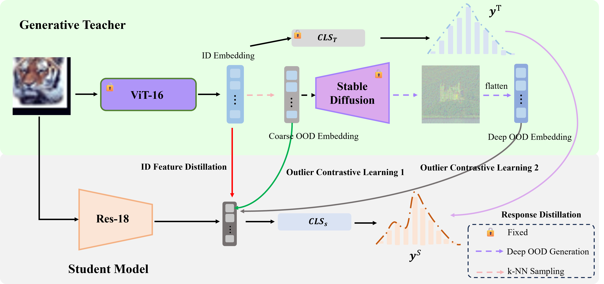
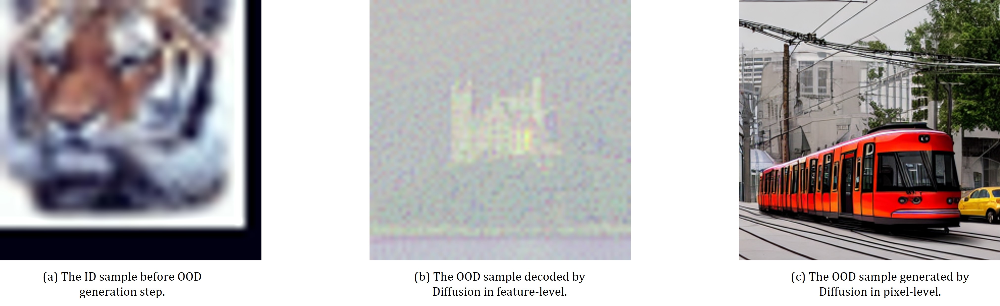
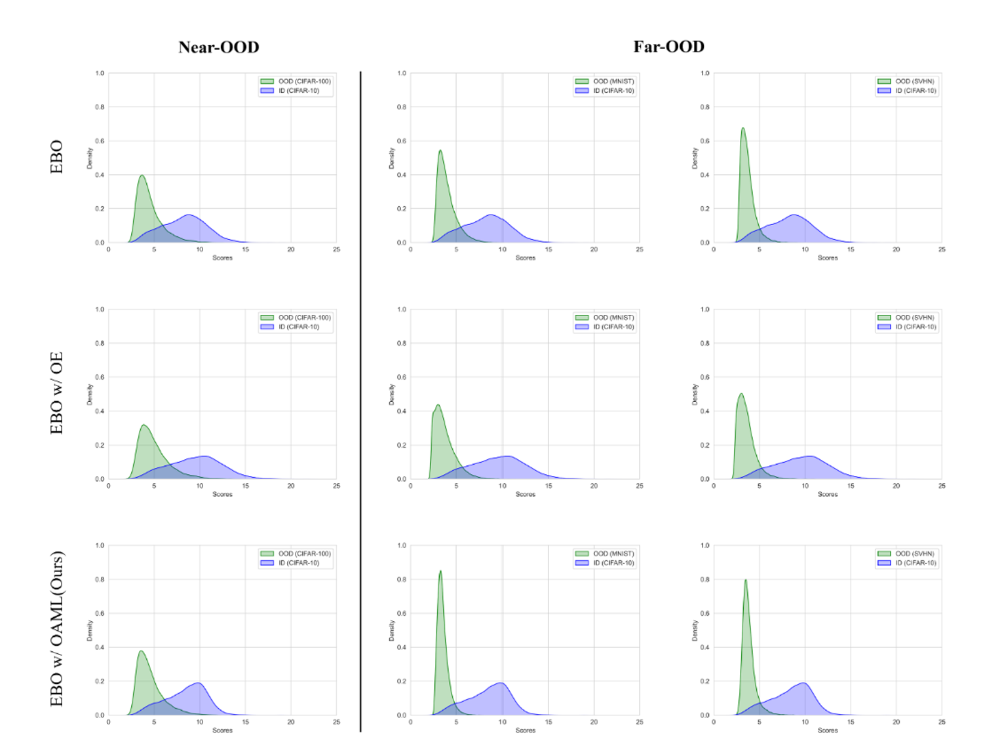

# OAML: Outlier Aware Metric Learning for OOD Detection Enhancement

> Heng Gao, Zhuolin He, Shoumeng Qiu, Jian Pu  
Fudan University

---

## 🚀Overview

In our research, we propose an **Outlier Aware Metric Learning (OAML)** framework. OAML mainly addresses the following issues in outlier exposure training for Out-of-Distribution (OOD) detection: 
- How to sample outliers via Stable Diffusion in the latent space;
- How to prevent In-Distribution (ID) performance degradation when training with OOD data.


  
To tackle these problems, we first take the noisy features obtained in the forward diffusion process as outliers for training. Then, we develop mutual information-based OOD-aware contrastive learning methods to enlarge ID/OOD feature discrepancies in semantic space. Both theoretical and experimental guarantees are given to verify the effectiveness of this contrastive learning approach. Aided by knowledge distillation, the ID accuracy does not degrade significantly when training with outliers.



## ✅Usage

### Installation

```sh
conda create -n openood python=3.8
pip install torch==1.13.1+cu117 torchvision==0.14.1+cu117 torchaudio==0.13.1 --extra-index-url https://download.pytorch.org/whl/cu117
wget https://codeload.github.com/Vastlab/libMR/zip/refs/heads/master
cd python
pip install -r requirements.txt
cd ../
pip install .
cd ../
git clone https://github.com/Jingkang50/OpenOOD.git
cd OpenOOD
pip install -e .
pip install timm
```

In order to better adapt to the OpenOOD framework, we changed the  `vision_transformer.py`  in the [Pytorch-Image-Models](https://github.com/huggingface/pytorch-image-models) library as follows:

```python
...
    def forward(self, x, return_feature):
        x = self.forward_features(x)
        x, pre_logits = self.forward_head(x)
        if return_feature:
            return x, pre_logits  
        else:
            return x
   
    def get_fc(self):
        fc = self.head
        return fc.weight.cpu().detach().numpy(), fc.bias.cpu().detach().numpy()

    def get_fc_layer(self):
        return self.head
...
```

### Data Preparation

Our codebase accesses the datasets from `./data/` and pretrained models from `./results/checkpoints/` . One can download the datasets via running  `./scripts/download/download.py`.

```
├── ...
├── data
│   ├── benchmark_imglist
│   ├── images_classic
│   └── images_largescale
├── openood
├── results
│   ├── checkpoints
│   └── ...
├── scripts
├── main.py
├── ...
```

### Outlier Synthesis in the Latent Space via Stable Diffusion
To synthesize OOD samples for outlier exposure training, please refer to [DreamOOD](https://github.com/deeplearning-wisc/dream-ood) code repository for installation. Note that, here we use `xformers==0.0.13`.

The first step outlier sampling by k-NN, please run the following command.
```python
python outlier-generation/scripts/get_embed_cifar100.py
```


The second step outlier generation via pre-trained Stable Diffusion，please run the following code.

```python
python outlier-generation/scripts/dream_ood.py --plms \
--n_iter 50 --n_samples 3 \
--outdir outlier-generation/nobackup-fast/txt2img-samples-cifar100-demo/ \
--loaded_embedding outlier-generation/nobackup-slow/dataset/my_xfdu/diffusion/outlier_npos_embed.npy\
--ckpt outlier-generation/nobackup-slow/dataset/my_xfdu/diffusion/sd-v1-4.ckpt \
--id_data cifar100 \
--skip_grid
```
#### 📝Generated Outliers
Our generated outliers are given in the following links, please download these data and load correctly when using OAML for training.

| In-Distribution Dataset  |                 Links                  |
| :---------: | :--------------------------------------: |
|  CIFAR-10   | [OneDrive](https://1drv.ms/f/s!Aihou-LHrVY1bWNNPOih97TctNw?e=shwtYv) |
|  CIFAR-100  | [OneDrive](https://1drv.ms/f/s!Aihou-LHrVY1bttqkBgZK3Jj7dI?e=CAowPg) |
| ImageNet-1k | [GoogleDrive](https://drive.google.com/file/d/1pWWEhaYSH7sNKCQ4wdbTMOgRmZATdOiS/view?usp=sharing) |  

#### 👽OOD Data Visualization Using CIFAR-100 as ID Data



### Training and Testing

#### 📝Teacher Model Pretrained Weights
Here is the pretrained weights of teacher models for Knowledge Distillation.

| In-Distribution Dataset  |                Download Links                  |
| :---------: | :--------------------------------------: |  
|  CIFAR-10   | [OneDrive](https://1drv.ms/f/s!Aihou-LHrVY1dpjxyf6lsCXg5dA?e=mwtucC) |
|  CIFAR-100  | [OneDrive](https://1drv.ms/f/s!Aihou-LHrVY1dx75YV-BKQX-zBA?e=FSmQjC) |
| ImageNet-1k | [OneDrive](https://1drv.ms/f/s!Aihou-LHrVY1eHrygBFiFM7k1Xk?e=WKNMtP) |


##### OAML Training

```sh
# Train with OAML on CIAFR-10
bash scripts/basics/cifar10/train_cifar10_oaml.sh
# Train with OAML on CIFAR-100
bash scripts/basics/cifar100/train_cifar100_oaml.sh
# Train with OAML on ImageNet-1k
bash scripts/basics/imagenet/train_imagenet1k_oaml.sh
```

##### OOD Testing

```sh
# Test on CIFAR-10 with EBO score
bash scripts/ood/cifar10_test_ood_ebo.sh
```
⚠️Before running this command, please load the oaml-trained model weights for testing!

## 🔭Score Distribution  Visualization

**OAML** reduces the variance of score distribution on both ID and OOD data. The overlap between two distributions is also minished.

## 📑Model Zoo

Here we provide pre-trained ResNet-18 on CIFAR-10/100 and ImageNet-1k.

| In-Distribution Dataset  |                 Vanilla                  |             Train with OAML              |
| :---------: | :--------------------------------------: | :--------------------------------------: |
|  CIFAR-10   | [OneDrive](https://1drv.ms/f/s!AlJaja8mSaMgeRL8EB3OjNC_SS4?e=E0152U) | [OneDrive](https://1drv.ms/f/s!AlJaja8mSaMggQtLPV3xHKfYuF2A?e=4Xrub2) |
|  CIFAR-100  | [OneDrive](https://1drv.ms/f/s!AlJaja8mSaMggSjwQLLYTwSp8lIp?e=gZ9LtV) | [OneDrive](https://1drv.ms/f/s!AlJaja8mSaMggSA3a14RbDuAqWhB?e=JcoF5i) |
| ImageNet-1k | [OneDrive](https://1drv.ms/f/s!AlJaja8mSaMggS8aZawLAtjLKw8y?e=AHEyjV) | [OneDrive](https://1drv.ms/f/s!AlJaja8mSaMggRJz5zGlcOZNxy8b?e=l9RCYY) |  

## 🎯 Acknowledgments

OAML is developed based on [OpenOOD](https://github.com/Jingkang50/OpenOOD/tree/main), [Pytorch-Image-Models](https://github.com/huggingface/pytorch-image-models) and [DreamOOD](https://github.com/deeplearning-wisc/dream-ood). Thanks to their great works.
